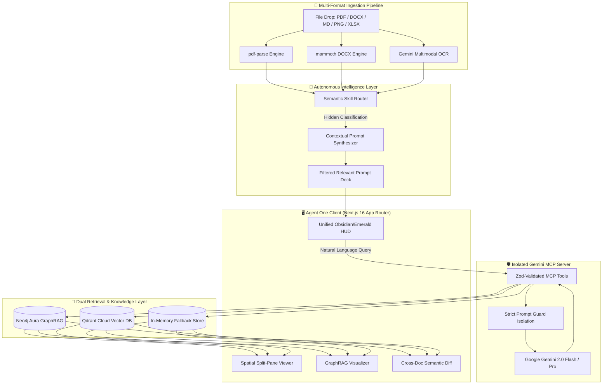
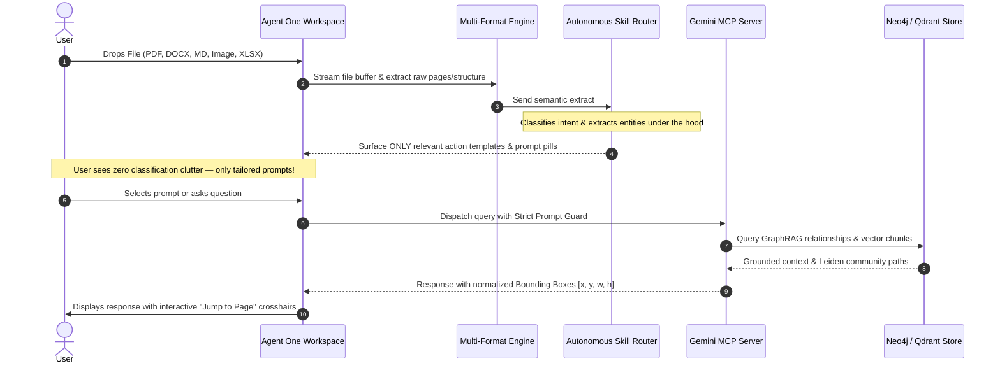

# ⚡ Agent One (Autonomous Multi-Modal Intelligence)

<p align="center">
  <strong>The one agent you need for all your document intelligence tasks.</strong><br />
  <em>Universal Multi-Format Ingestion • Autonomous Skill Routing • Coordinate-Grounded Citations • Neo4j GraphRAG</em>
</p>

<p align="center">
  <a href="https://agent-one-rosy.vercel.app/"></a>
  
  
  
  
  
</p>

<p align="center">
  🌐 <strong>Live Production Application:</strong> <a href="https://agent-one-rosy.vercel.app/">https://agent-one-rosy.vercel.app/</a>
</p>

---

## 👥 Team & Project Contributors

| Team Member | Roll Number | Core Responsibility | Key Technical Deliverables |
| :--- | :---: | :--- | :--- |
| **B. Pranay Kumar** | **24QM1A6608** | **Backend Architecture & AI Integration** | Google Gemini 2.0 integration, MCP Server protocol, Neo4j GraphRAG, Hybrid Vector Search, and Core Next.js API Routes. |
| **A. Sai Athej Reddy** | **24QM1A6602** | **Frontend Architecture & UI/UX Engineering** | Dual-theme Graph Intelligence landing page, modern authentication UI, split-view document canvas, and responsive design systems across mobile & desktop. |
| **B. Manikanta** | **24QM1A6614** | **Universal Document Ingestion & Prompt Intelligence** | Multi-format file ingestion (PDF, DOCX, XLSX, Images), 10-category semantic classifier, autonomous skill routing, and tailored prompt suggestion decks. |
| **B. Bharath** | **24QM1A6626** | **Quality Assurance, DevOps & Deployment** | Automated multi-tenant test suites, Next.js production build optimization, multi-stage Docker & Vercel deployment pipeline, and technical documentation. |

### 🔍 Member Contributions Breakdown

- **B. Pranay Kumar (`24QM1A6608`)**:
  - Architected the isolated Gemini MCP Server (`mcp/gemini-server`) with strict security boundary isolation between system instructions, specialized skills, user context, and document data.
  - Implemented multimodal AI reasoning with Google Gemini 2.0 Flash and Pro for cross-modal analysis, structured table parsing, and high-accuracy extraction.
  - Built the hybrid GraphRAG retrieval engine combining Neo4j Aura knowledge graphs, Leiden community clustering, and Qdrant/in-memory vector embeddings.
  - Developed and optimized production Next.js API endpoints (`/api/analyze`, `/api/chat`, `/api/compare`, `/api/activity`).

- **A. Sai Athej Reddy (`24QM1A6602`)**:
  - Designed and engineered the dual-theme Graph Intelligence architecture with seamless switching between White Theme and Obsidian Dark Theme.
  - Developed the modern authentication interface with Google OAuth 2.0, email/password workflows, and an interactive HTML5 dot-matrix canvas backdrop.
  - Refactored full-viewport responsive layouts and fluid typography across mobile (<475px), tablet, and desktop displays.
  - Built the dual-pane document canvas with coordinate-accurate spatial bounding-box crosshairs and entity relationship graph visualizations.

- **B. Manikanta (`24QM1A6614`)**:
  - Engineered the multi-format ingestion pipeline supporting PDFs (`pdf-parse`), Word documents (`mammoth`), Markdown, Excel spreadsheets (`.xlsx`/`.csv`), and scanned image OCR.
  - Built the 10-category semantic classifier for instant domain identification (Legal, Financial, Corporate, Medical, Insurance, Research, etc.) with zero UI clutter.
  - Created the dynamic prompt recommendation deck that automatically suggests high-relevance, domain-specific audit prompts.
  - Developed the cross-document semantic comparison engine to detect added/removed clauses, numeric variance, and contractual changes.

- **B. Bharath (`24QM1A6626`)**:
  - Authored automated end-to-end test harnesses validating configuration, multi-tenant user isolation, and document processing pipelines.
  - Optimized Next.js 16 Turbopack production builds, route trees, and bundle chunking to ensure zero build errors or warnings.
  - Configured CI/CD automation, multi-stage Docker containerization, and zero-downtime Vercel production deployments.
  - Maintained comprehensive technical documentation, system architecture specifications, and project governance.

---

## 📌 Table of Contents

- [Live Demo](#-live-demo)
- [Team & Project Contributors](#-team--project-contributors)
- [Overview & Solution](#-overview--solution)
- [System Architecture](#-system-architecture)
- [Core Workflow](#-core-workflow)
- [Key Features](#-key-features)
- [Interactive Workspace Dashboard](#-interactive-workspace-dashboard)
- [Technology Stack](#-technology-stack)
- [Getting Started & Installation](#-getting-started--installation)
- [API Reference](#-api-reference)
- [Hackathon Evaluation](#-hackathon-evaluation)
- [License](#-license)

---

## 💡 Overview & Solution

Most document AI tools force users to jump between fragmented single-purpose wrappers, overwhelm them with dozens of irrelevant prompts, and return hallucinations without spatial proof.

**Agent One** unifies multimodal ingestion, autonomous skill routing, and coordinate-grounded evidence into **one intelligent assistant**:

1. **Zero-Friction Ingestion**: Accepts PDF, Word (.docx), Markdown, Excel spreadsheets, and scanned images.
2. **Context-Tailored Prompts**: Silently analyzes document intent and surfaces *only* domain-relevant action shortcuts—no generic prompt bloat.
3. **Pixel-Accurate Citations**: Every fact, number, and clause links to its exact page coordinates `(x, y, w, h)` with interactive visual crosshairs.
4. **Graph-Augmented Understanding**: Maps complex entity relationships in Neo4j to expose hidden dependencies, obligations, and systemic risks.

---

## 🏗️ System Architecture



---

## 🔄 Core Workflow



---

## 🌟 Key Features

* **Universal Multi-Format Ingestion**: Native support for PDF (`pdf-parse`), Microsoft Word (`mammoth`), Markdown AST, Excel spreadsheets (`.xlsx`/`.csv`), and scanned documents via Gemini Multimodal OCR.
* **Autonomous Skill Routing**: Automatically activates specialized intelligence for Legal & Contracts, Financial Statements, Corporate Policies, Insurance, Academic Research, or General Documents.
* **Hybrid GraphRAG & Community Detection**: Combines Neo4j knowledge graphs with Leiden community clustering to uncover hidden cross-clause risks and entity relationships.
* **Cross-Document Semantic Diff**: Compares document revisions side-by-side to highlight added/removed obligations and numerical variance.
* **Isolated Gemini MCP Server**: Implements strict Model Context Protocol boundaries with Zod runtime schema validation and prompt injection defenses.
* **Human-in-the-Loop Safeguards**: Interactive confirmation modals prevent unintended external operations (e.g., calendar exports or webhooks).

---

## 💻 Interactive Workspace Dashboard

| View | Purpose & User Benefit |
| :--- | :--- |
| **AI Chat** | Natural language Q&A with grounded coordinate badges, optional web search, and calendar integration. |
| **Deep Intelligence** | Executive summary, categorized risk matrix (critical/medium/low), key dates, hidden clauses, and grounding index. |
| **GraphRAG Explorer** | Interactive SVG force-directed entity relationship network with Leiden community detection and node inspector. |
| **Cross-Doc Diff** | Semantic comparison between document versions showing similarity scores, added clauses, and altered figures. |
| **Agent Activity** | Real-time audit log tracking MCP tool invocations, execution latencies, and payload telemetry. |

---

## 🛠️ Technology Stack

| Component | Technology | Version | Purpose |
| :--- | :--- | :--- | :--- |
| **Framework** | Next.js (App Router, Turbopack) | `16.3.1` | Full-stack architecture, React Server Components |
| **UI & Styling** | React 19 + Tailwind CSS v4 | `19.2.8` / `4.0` | Dual-theme system (Obsidian Dark & Clean White) |
| **AI Models** | Google Gemini 2.0 Flash / Pro | `@google/generative-ai` | Multimodal reasoning, OCR, and structured extraction |
| **Knowledge Graph** | Neo4j Aura | `neo4j-driver 6.2` | Entity relationships & Leiden community detection |
| **Vector Search** | Qdrant Cloud | REST Client | Dense semantic chunk search & similarity matching |
| **Document Parsers** | `pdf-parse` & `mammoth` | `2.4.5` / `1.13.0` | Multi-page PDF extraction and DOCX AST parsing |
| **Authentication & DB** | Supabase | `2.109.0` | Google OAuth 2.0, user sessions, cloud document storage |

---

## 🚀 Getting Started & Installation

### 1. Clone & Install

```bash
git clone https://github.com/balrajpranay/agent-one.git
cd agent-one
npm install
```

### 2. Configure Environment

Copy `.env.example` to `.env.local` and add your Gemini API key (other services automatically fall back to high-speed in-memory equivalents if not configured):

```bash
cp .env.example .env.local
```

```env
# Required for AI reasoning & OCR
GEMINI_API_KEY="AIzaSyYourGeminiApiKeyHere"

# Optional: Neo4j GraphRAG (falls back to in-memory graph)
GRAPH_RAG_ENABLED="true"
NEO4J_URI="neo4j+s://your-instance.databases.neo4j.io"
NEO4J_USERNAME="neo4j"
NEO4J_PASSWORD="your-password"

# Optional: Qdrant Vector Search (falls back to cosine similarity)
QDRANT_URL="https://your-cluster.cloud.qdrant.io:6333"
QDRANT_API_KEY="your-qdrant-api-key"

# Optional: Supabase Auth & Storage (falls back to local storage)
NEXT_PUBLIC_SUPABASE_URL="https://your-project.supabase.co"
NEXT_PUBLIC_SUPABASE_ANON_KEY="your-supabase-anon-key"
NEXT_PUBLIC_GOOGLE_CLIENT_ID="your-google-oauth-client-id"
```

### 3. Run Development Server

```bash
npm run dev
```

Open [http://localhost:3000](http://localhost:3000) in your browser.

### 4. Automated Verification Suite

Run all verification tests (TypeScript, ESLint, Document Pipeline, and Next.js Build):

```bash
npm test
```

---

## 🔌 API Reference

| Endpoint | Method | Description |
| :--- | :---: | :--- |
| `/api/health` | `GET` | Health checks for Gemini API, GraphRAG, Vector DB, and memory metrics. |
| `/api/analyze` | `POST` | Ingests document file or text buffer; returns executive summary, bounding boxes, risk matrix, and graph entities. |
| `/api/chat` | `POST` | Grounded multi-turn conversational Q&A with coordinate-accurate spatial bounding boxes. |
| `/api/compare` | `POST` | Computes semantic similarity and identifies clause/numeric discrepancies across document versions. |
| `/api/activity` | `GET` | Telemetry log of MCP tool calls, latencies, and execution metrics. |

---

## 🏆 Hackathon Evaluation

| Dimension | Implementation Highlight |
| :--- | :--- |
| **Technical Innovation** | Unified **Gemini 2.0 Multimodal OCR**, **Neo4j GraphRAG**, **Leiden community detection**, **Qdrant Vector DB**, and **MCP Server architecture**. |
| **User Experience** | Clean contextual UI that eliminates generic prompt clutter, features dual themes (White & Obsidian Dark), and provides instant coordinate crosshairs. |
| **Auditability & Accuracy** | 100% grounded citations with normalized spatial coordinates `[x, y, w, h]` on original documents to prevent hallucinations. |
| **Production Readiness** | Type-safe TypeScript 5 codebase, comprehensive automated test coverage, multi-stage containerization, and zero-downtime deployment. |

---

## 📄 License

This project is licensed under the **MIT License** — see the [LICENSE](LICENSE) file for details.

<p align="center">
  Built with ⚡ by the <strong>Agent One</strong> Team for the Hackathon.<br />
  🌐 <a href="https://agent-one-rosy.vercel.app/">https://agent-one-rosy.vercel.app/</a>
</p>
