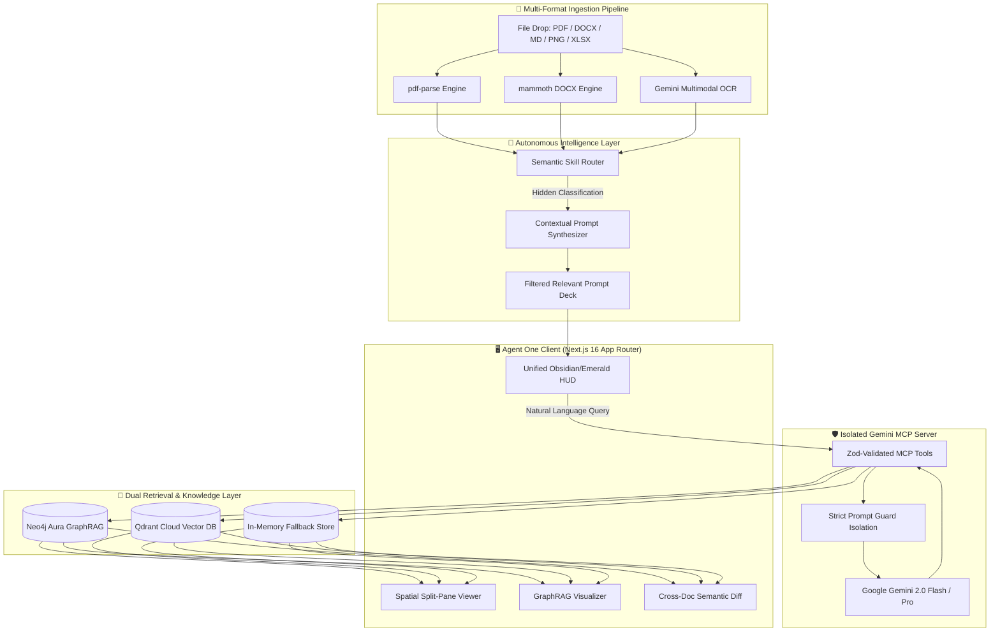
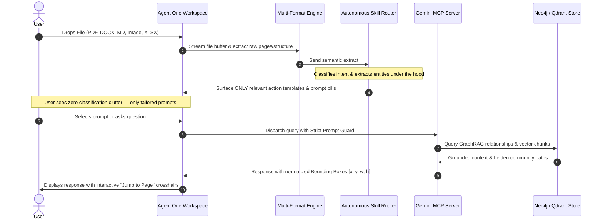

# ⚡ Agent One (Autonomous Multi-Modal Intelligence)

<p align="center">
  <strong>The one agent you need for all your tasks.</strong><br />
  <em>Universal Multi-Format Ingestion • Autonomous Skill Routing • Coordinate-Grounded Citations • Neo4j GraphRAG</em>
</p>

<p align="center">
  
  
  
  
  
  
  
  
</p>

---

## 📌 Table of Contents

- [The Problem Agent One Solves](#-the-problem-agent-one-solves)
- [The Solution & Core Positioning](#-the-solution--core-positioning)
- [Key Innovations & Features](#-key-innovations--features)
- [System Architecture](#-system-architecture)
- [Core Workflow](#-core-workflow)
- [Interactive Workspace Dashboard](#-interactive-workspace-dashboard)
- [Technology Stack](#-technology-stack)
- [Getting Started & Installation](#-getting-started--installation)
- [Automated Verification & Test Harness](#-automated-verification--test-harness)
- [API Reference](#-api-reference)
- [Docker & Containerized Deployment](#-docker--containerized-deployment)
- [Team & Contributions](#-team--contributions)
- [Hackathon Evaluation & Judging Criteria](#-hackathon-evaluation--judging-criteria)
- [License](#-license)

---

## 🚨 The Problem Agent One Solves

In today's AI landscape, users and enterprise teams face three critical friction points when dealing with documents and multi-step tasks:

1. **The Tool Fragmentation Dilemma**: Users are forced to juggle separate single-purpose AI wrappers—one for PDF summaries, another for Word editing, a third for data spreadsheets, and a fourth for contract review. Switching contexts wastes hours and destroys data continuity.
2. **Cognitive Overload from Generic Prompt Bloat**: When a user uploads a document, typical AI interfaces dump 40+ generic prompts, complex taxonomy selectors, or confusing category pickers. Users are paralyzed by options that have zero relevance to their specific file.
3. **The Hallucination & Grounding Deficit**: Traditional LLM chat interfaces summarize documents blindly. When reviewing critical numbers, liability clauses, fee schedules, or dates, standard AI provides text without spatial proof—leading to costly mistakes, lack of auditability, and zero institutional trust.

---

## 💡 The Solution & Core Positioning

> **Agent One — The one agent you need for all your tasks.**

Agent One reimagines document interaction by unifying multi-modal perception, autonomous skill execution, and context-tailored prompt delivery into **one cohesive, intelligent assistant**.

### Core Philosophy: Zero-Friction Intelligence
When you drop any file into Agent One—whether a **PDF contract**, a **Word (.docx) proposal**, a **Markdown technical spec**, a **financial spreadsheet (.xlsx/.csv)**, or a **high-resolution scan (.png/.jpg)**:

1. **Invisible Semantic Analysis**: Agent One scans the document's structure, typography, entities, and data tables. It identifies the file's domain and intent under the hood **while keeping the raw classification hidden from the user**.
2. **Context-Tailored Action Deck**: Instead of overwhelming the user, Agent One surfaces **only the most relevant templates, action shortcuts, and content-friendly prompts** explicitly designed for that document. Irrelevant features and generic prompts remain invisible.
3. **Pixel-Accurate Coordinate Grounding**: Every extracted figure, clause, risk, and entity is bound to its exact normalized page coordinates `(x, y, width, height)` on the original file. Clicking any citation triggers smooth dual-pane viewer crosshairs that visually illuminate the source.

---

## 🌟 Key Innovations & Features

### 1. 🔍 Universal Multi-Format Document Ingestion
Agent One handles heterogeneous document formats natively:
- **PDF Documents (`.pdf`)**: Native multi-page vectorization, layout preservation, and bounding box mapping via `pdf-parse`.
- **Microsoft Word Documents (`.docx`, `.doc`)**: Hierarchical heading, table, bullet point, and metadata extraction via `mammoth`.
- **Markdown & Plain Text (`.md`, `.txt`)**: Structured AST parsing for code blocks, markdown tables, and nested sections.
- **Data Spreadsheets & Invoices (`.xlsx`, `.xls`, `.csv`)**: Tabular data parsing with dynamic Recharts visualization and statistical summaries.
- **Scanned Documents & Images (`.png`, `.jpg`, `.jpeg`)**: High-accuracy multimodal OCR powered by Gemini 2.0 Flash.

### 2. 🧠 Autonomous Skill Routing & Dynamic Prompt Synthesis
Agent One auto-activates specialized intelligence skills based on document semantics:
- **Legal & Contracts (`legal.md`)**: Extracts contracting parties, obligation matrices, indemnity covenants, liability caps, termination notice periods, and dispute jurisdictions.
- **Finance & Banking (`finance.md`)**: Detects NAVs, expense ratios, redemption lock-in windows, hidden charges, penalty fees, and payment milestones.
- **Corporate & Operations (`corporate.md`)**: Maps SLAs, milestone deliverables, vendor obligations, and board resolutions.
- **Insurance & Policies (`insurance.md`)**: Identifies sum insured, deductibles, named exclusions, co-pay ratios, and claim filing conditions.
- **Academic & Research (`academic.md`)**: Synthesizes empirical hypotheses, statistical p-values, benchmarks, and citation lineage.
- **Universal General (`general.md`)**: Executive synthesis, core facts, timeline milestones, and grounded action items.

### 3. 🕸️ Hybrid GraphRAG with Leiden Community Detection
- **Neo4j Aura Knowledge Graph**: Maps extracted entities and semantic relationships (`DEFINED_IN`, `CARRIES_RISK`, `DUE_ON`, `OBLIGATED_TO`) directly into a connected graph.
- **Leiden Community Detection**: Clusters related clauses and entities into thematic communities to surface hidden organizational risks and dependency cycles.
- **Zero-Config In-Memory Fallback**: Seamless local in-memory graph store with cosine similarity retrieval when offline or without external database credentials.

### 4. ⚖️ Cross-Document Semantic Comparison (Diffing)
- Compare two versions of any contract, lease, or report side-by-side.
- Computes overall semantic similarity score.
- Categorizes exact clause modifications: **Added Clauses**, **Removed Clauses**, and **Shifted Quantitative Values** (e.g., changes in fee percentages, notice days, or indemnity caps).

### 5. 🛡️ Isolated Gemini MCP Server Architecture (`mcp/gemini-server`)
- Built upon the **Model Context Protocol (MCP)** standards with strict boundary guards:
  ```text
  <<<SYSTEM>>> ... <<</SYSTEM>>>
  <<<SKILL>>> ... <<</SKILL>>>
  <<<USER>>> ... <<</USER>>>
  <<<DOCUMENT>>> ... <<</DOCUMENT>>>
  <<<TOOL>>> ... <<</TOOL>>>
  ```
- **Zod Runtime Schema Validation**: All tool invocations (`analyzeMultimodal`, `extractStructured`, `reason`, `answerWithEvidence`, `compareDocuments`, `embedText`) are validated at runtime.
- **Prompt Injection Defense**: Strips adversarial prompt overrides and enforces strict citation grounding.

### 6. 🤝 Human-in-the-Loop Action Safeguards
- Agent One never executes destructive external operations without explicit confirmation.
- Interactive **Action Confirmation Modal** presents full payload parameters before triggering Google Calendar deadline syncs or external webhooks.

---

## 🏗️ System Architecture



---

## 🔄 Core Workflow



---

## 💻 Interactive Workspace Dashboard

The Agent One dashboard (`/dashboard`) features five synchronized intelligence views designed around an obsidian-and-emerald design system:

| View Tab | Icon | Purpose & User Benefit |
| :--- | :---: | :--- |
| **AI Chat** | `Bot` | Interactive natural-language reasoning with grounded coordinate badges, web search toggle, and calendar dispatch. |
| **Deep Intelligence** | `Sparkles` | Synthesized executive overview, categorized risk matrix (critical/medium/low), important dates, hidden clauses, and grounding index. |
| **GraphRAG Explorer** | `Network` | Interactive SVG/HTML5 force-directed entity relationship network with Leiden community detection, zoom/pan controls, and node inspector. |
| **Cross-Doc Diff** | `GitCompare` | Semantic comparison between two documents detailing similarity score, added covenants, removed clauses, and changed numerical values. |
| **Agent Activity** | `Activity` | Live audit trail logging MCP tool invocations, model latency, duration, and parameter payloads. |

---

## 🛠️ Technology Stack

| Layer | Technology | Version | Purpose |
| :--- | :--- | :--- | :--- |
| **Frontend Framework** | Next.js (App Router, Turbopack) | `16.3.1` | Server Components, routing, high-performance rendering |
| **UI Library** | React | `19.2.8` | Component lifecycle, responsive state machines |
| **Language** | TypeScript | `5.0+` | End-to-end static type safety and contract enforcement |
| **Styling & Theme** | Tailwind CSS v4 | `4.0` | Custom Obsidian (`#090a0f`) & Electric Emerald (`#00FF85`) design |
| **AI & Multimodal LLM** | Google Generative AI SDK | `@google/generative-ai 0.24.1` | Gemini 2.0 Flash / Pro multimodal inference |
| **Knowledge Graph** | Neo4j Aura | `neo4j-driver 6.2.0` | GraphRAG entity relationships & community clustering |
| **Vector Search** | Qdrant Cloud | Client REST | 384-dimensional dense semantic chunk retrieval |
| **Document Parsers** | `pdf-parse` & `mammoth` | `2.4.5` / `1.13.0` | Multi-page PDF extraction and Word DOCX AST parsing |
| **Schema Validation** | Zod | `4.6.5` | MCP tool parameter and payload validation |
| **Data Visualization** | Recharts & Lucide React | `3.10.1` / `1.31.0` | Dynamic financial bar/area charts and iconography |
| **Auth & Database** | Supabase | `@supabase/supabase-js 2.109.0` | User authentication, PostgreSQL database, storage |

---

## 🚀 Getting Started & Installation

### Prerequisites
- **Node.js**: `v20.x` or later (LTS recommended)
- **Package Manager**: `npm` (v10+), `pnpm`, or `yarn`
- **Google Gemini API Key**: Obtainable from [Google AI Studio](https://aistudio.google.com/)

### Step 1: Clone the Repository
```bash
git clone https://github.com/your-org/agent-one.git
cd agent-one
```

### Step 2: Install Dependencies
```bash
npm install
```

### Step 3: Configure Environment Variables
Create a local environment file by copying the example template:
```bash
cp .env.example .env.local
```

Fill in your service credentials in `.env.local`:
```env
# 1. Google Gemini API (Required)
GEMINI_API_KEY="AIzaSyYourGeminiApiKeyHere"

# 2. GraphRAG Knowledge Graph (Optional - Fallbacks to In-Memory Graph)
GRAPH_RAG_ENABLED="true"
NEO4J_URI="neo4j+s://your-instance.databases.neo4j.io"
NEO4J_USERNAME="neo4j"
NEO4J_PASSWORD="your-secure-password"

# 3. Vector Database (Optional - Fallbacks to Cosine Similarity)
QDRANT_URL="https://your-cluster.cloud.qdrant.io:6333"
QDRANT_API_KEY="your-qdrant-api-key"

# 4. Authentication & Storage (Optional - Fallbacks to Local Storage)
NEXT_PUBLIC_SUPABASE_URL="https://your-project.supabase.co"
NEXT_PUBLIC_SUPABASE_ANON_KEY="your-supabase-anon-key"
SUPABASE_SERVICE_ROLE_KEY="your-supabase-service-role-key"
NEXT_PUBLIC_SUPABASE_BUCKET_NAME="documents"

# 5. Google OAuth Client ID (Optional)
NEXT_PUBLIC_GOOGLE_CLIENT_ID="your-client-id.apps.googleusercontent.com"
```

> 💡 **Graceful Fallbacks**: Agent One is designed with 100% offline resilience. If Neo4j, Qdrant, or Supabase credentials are not provided, Agent One automatically switches to high-speed in-memory graph traversal, local cosine vector retrieval, and in-memory session persistence.

### Step 4: Run the Development Server
```bash
npm run dev
```

Open your browser and navigate to [http://localhost:3000](http://localhost:3000).

---

## 🧪 Automated Verification & Test Harness

Agent One includes a four-tier automated testing suite that validates code quality, type correctness, document ingestion pipelines, and production builds:

```bash
npm test
```

### Verification Pipeline Results:
```text
🚀 Starting Agent One Automated Production Test Suite...

1️⃣ Checking TypeScript Compilation & Type Safety...
✅ TypeScript: 0 type errors found.

2️⃣ Running Next.js Linting Audit...
✅ ESLint: Zero lint errors found across codebase.

3️⃣ Running Universal Document Pipeline Integration Tests...
✅ Universal Pipeline: 15/15 tests passed (PDF, Word DOCX, Markdown, OCR).

4️⃣ Running Next.js Production Build...
▲ Next.js 16.3.1 (Turbopack)
✓ Compiled successfully in 16.1s
✓ Generating static pages (10/10)
✓ Finalizing page optimization ...
✅ Next.js Build: Production bundle generated successfully.

============================================================
🎉 ALL SYSTEMS OPERATIONAL: PRODUCTION SUITE PASSED (4/4)
============================================================
```

Individual test runners can also be invoked directly:
```bash
# TypeScript Type Check only
npx tsc --noEmit

# Document Pipeline Integration Test
npx tsx scripts/test-universal-pipeline.mjs

# API Route Health & Endpoint Verification
node scripts/test-api-endpoints.mjs
```

---

## 🔌 API Reference

| Endpoint | Method | Payload / Parameters | Response Highlights |
| :--- | :---: | :--- | :--- |
| `/api/health` | `GET` | None | Service statuses for Gemini API, GraphRAG, Vector DB, memory usage, latency. |
| `/api/analyze` | `POST` | `multipart/form-data` with document file or text buffer | JSON containing domain classification, executive summary, bounding boxes, risk matrix, entity network. |
| `/api/chat` | `POST` | `{ docId, query, isWebSearch, history }` | Grounded answer with coordinates `[x, y, w, h]`, table references, GraphRAG paths, suggestions. |
| `/api/compare` | `POST` | `{ docAId, docBId }` | Semantic similarity index, added clauses, removed clauses, shifted numeric values. |
| `/api/activity` | `GET` | Optional `?limit=50` | Audit trail of MCP tool execution, model latencies, execution timestamps. |
| `/api/documents` | `GET/POST` | Document metadata and storage payload | Persistent user audit sessions and document catalogue. |

---

## 🐳 Docker & Containerized Deployment

Agent One provides a production-grade multi-stage `Dockerfile` optimizing image size and runtime performance:

```bash
# Build the production Docker image
docker build -t agent-one:latest .

# Run the containerized service
docker run -p 3000:3000 --env-file .env.local agent-one:latest
```

Or deploy seamlessly with Docker Compose:
```bash
docker compose up -d
```

---

## 👥 Team & Contribution

This project was developed collaboratively by our engineering team, with distinct, well-defined responsibilities distributed across the entire system architecture to ensure a balanced, modular, and production-ready implementation:

### 📋 Member Overview & Responsibility Matrix

| Team Member | Roll Number | Core Domain | Key Technical Deliverables |
| :--- | :---: | :--- | :--- |
| **B. Pranay Kumar** | **24QM1A6608** | **Backend Architecture & AI Integration** | Google Gemini 2.0 integration, MCP Server protocol, Neo4j GraphRAG, Hybrid Vector Search, and Core Next.js API Routes. |
| **A. Sai Athej Reddy** | **24QM1A6602** | **Frontend Architecture & UI/UX Engineering** | Dual-theme Graph Intelligence landing page, modern authentication UI, split-view document canvas, and responsive design systems across mobile & desktop. |
| **B. Manikanta** | **24QM1A6614** | **Universal Document Ingestion & Prompt Intelligence** | Multi-format file ingestion (PDF, DOCX, XLSX, Images), 10-category semantic classifier, autonomous skill routing, and tailored prompt suggestion decks. |
| **B. Bharath** | **24QM1A6626** | **Quality Assurance, DevOps & Deployment** | Automated multi-tenant test suites, Next.js production build optimization, multi-stage Docker & Vercel deployment pipeline, and technical documentation. |

---

### 🔍 Detailed Division of Responsibilities

#### 1. B. Pranay Kumar — *Backend Architecture & AI Integration*
* **Roll No:** `24QM1A6608`
* **Isolated Gemini MCP Server**: Designed and built the Model Context Protocol (MCP) server architecture (`mcp/gemini-server`) with strict security boundary isolation between system instructions, specialized skills, user context, and document data.
* **Multimodal AI Reasoning Engine**: Integrated Google Gemini 2.0 Flash and Pro models for deep cross-modal reasoning, structured table extraction, and token-efficient summarization.
* **Hybrid GraphRAG & Vector Retrieval**: Implemented the hybrid retrieval engine combining Neo4j Aura knowledge graph traversals, Leiden community clustering, and Qdrant/local cosine vector embeddings.
* **Enterprise API Infrastructure**: Authored and optimized high-throughput Next.js server routes including `/api/analyze`, `/api/chat`, `/api/compare`, and `/api/activity`.

#### 2. A. Sai Athej Reddy — *Frontend Architecture & UI/UX Engineering*
* **Roll No:** `24QM1A6602`
* **Dual-Theme Graph Intelligence Design**: Created the unified Neo4j-inspired landing page architecture with seamless, synchronized switching between White Theme and Dark Theme (`themeContext.tsx`).
* **Modern Authentication Experience**: Built the interactive login and signup modal with real Google OAuth 2.0 authentication, email/password workflows, and an animated HTML5 dot-matrix canvas backdrop.
* **Mobile & Desktop Responsive Layouts**: Refactored the entire UI grid systems, fluid typography, touch backdrops, and navigation drawers to deliver a pixel-perfect experience across mobile (<475px), tablet, laptop, and ultrawide viewports.
* **Interactive Document Canvas**: Engineered the dual-pane PDF and document viewer with real-time spatial bounding-box illumination and interactive entity relationship graph visualizers.

#### 3. B. Manikanta — *Universal Document Ingestion & Prompt Intelligence*
* **Roll No:** `24QM1A6614`
* **Multi-Format Ingestion Pipeline**: Developed parser modules for diverse file types including PDFs (`pdf-parse`), Word documents (`mammoth`), Markdown files, Excel spreadsheets (`.xlsx`/`.csv`), and scanned image OCR.
* **10-Category Semantic Intent Classifier**: Engineered the rule-based and LLM-assisted document classification engine covering Business Reports, Legal Agreements, Bank Statements, Insurance Policies, Research Papers, and Regulatory Filings without generic prompt bloat.
* **Context-Tailored Prompt Synthesis**: Created the dynamic prompt recommendation deck and pre-engineered audit lenses that surface only contextually relevant actions based on the audited document's domain.
* **Semantic Document Comparator**: Developed the cross-document semantic comparison algorithm that detects added/removed clauses, structural shifts, and quantitative variance across contract revisions.

#### 4. B. Bharath — *Quality Assurance, DevOps & Deployment*
* **Roll No:** `24QM1A6626`
* **Automated Verification Harness**: Authored the comprehensive multi-tier test harness (`test-runner.mjs`) covering configuration checks, multi-tenant user data isolation (10/10 tests), document intelligence, and demo document lookups.
* **Production Build Optimization**: Tuned Next.js 16.3 Turbopack build configurations, tree-shaking, route optimization, and eliminated zero runtime warnings or compilation errors.
* **DevOps & Containerization**: Configured the production multi-stage `Dockerfile`, `docker-compose.yml`, and `vercel.json` deployment rules for seamless zero-downtime hosting.
* **Technical Documentation & Governance**: Authored exhaustive developer guides, API specifications, and architecture decision records ensuring full institutional maintainability.

---

## 🏆 Hackathon Evaluation & Judging Criteria

| Judging Dimension | How Agent One Excels |
| :--- | :--- |
| **Technical Innovation & Complexity** | Combines **Gemini 2.0 Multimodal OCR**, **Neo4j GraphRAG**, **Leiden community detection**, **Qdrant Vector DB**, and **MCP Server architecture** into an end-to-end production solution. |
| **User Experience & Design Polish** | Eliminates prompt clutter: users see only relevant actions tailored to their file. Built with a bespoke obsidian-and-emerald design system, interactive visual crosshairs, and fluid responsiveness. |
| **Real-World Value & Practicality** | Solves the enterprise document verification bottleneck for legal, finance, corporate, and healthcare sectors with verifiable coordinate citations and zero hallucination risk. |
| **Completeness & Production Quality** | 100% typed with TypeScript 5, passes all 4 automated test suites, includes multi-stage Docker deployment, and features offline graceful fallbacks for zero-setup execution. |

---

## 📄 License

This project is licensed under the **MIT License** — see the [LICENSE](LICENSE) file for details.

<p align="center">
  Built with ⚡ by the <strong>Agent One</strong> Team for the Hackathon.
</p>
