# 🛠️ Agent One — Technical Stack Documentation

> **Comprehensive Architecture, Framework, Model, and Infrastructure Reference**  
> *Version: 2.0.0 | Production Release*  
> *Live Deployment: [https://agent-one-rosy.vercel.app/](https://agent-one-rosy.vercel.app/)*  
> *Repository: [https://github.com/balrajpranay/agent-one](https://github.com/balrajpranay/agent-one)*

---

## 📌 Executive Summary

Agent One is an autonomous multimodal document intelligence workspace engineered to unify heterogeneous document ingestion, silent semantic domain routing, pixel-accurate spatial evidence grounding, and hybrid GraphRAG retrieval into a cohesive, high-performance platform.

This document serves as the **authoritative technical documentation** of all languages, frameworks, AI models, vector stores, graph engines, protocols, and infrastructure powering the system.

---

## 🏗️ Architectural Topology

```mermaid
flowchart TD
    subgraph ClientLayer["🖥️ Frontend & Workspace HUD"]
        NextApp["Next.js 16 (App Router + RSC)"]
        ReactUI["React 19 + Tailwind CSS v4"]
        Viewer["Dual-Pane Spatial Bounding-Box Viewer"]
        GraphViz["Force-Directed SVG Graph Visualizer"]
        Theme["Dual-Theme Engine (Obsidian Dark / Clean White)"]
    end

    subgraph IngestionLayer["📂 Universal Ingestion Engine"]
        PDF["pdf-parse (PDF AST & Coordinates)"]
        DOCX["mammoth (Word DOCX AST)"]
        MD["Markdown AST Parser"]
        Sheets["Tabular Parser (XLSX / CSV)"]
        OCR["Gemini 2.0 Multimodal OCR"]
    end

    subgraph MCPLayer["🛡️ Isolated Gemini MCP Server (mcp/gemini-server)"]
        Guard["Boundary Enforcement Tag Isolation"]
        ZodVal["Zod 4.6.5 Runtime Schema Validation"]
        MCPTools["6 Specialized MCP Analysis Tools"]
    end

    subgraph AIModelLayer["🧠 AI Reasoning & Foundation Models"]
        GeminiFlash["Google Gemini 2.0 Flash (Primary)"]
        GeminiPro["Google Gemini 2.0 Pro (Complex Reasoning)"]
        Classifier["10-Category Semantic Intent Router"]
        FallbackCascade["Multi-Model Auto-Failover Cascade"]
    end

    subgraph DataRetrievalLayer["💾 Dual-Retrieval & Knowledge Layer"]
        Neo4j["Neo4j Aura Cloud (GraphRAG + Leiden Clustering)"]
        Qdrant["Qdrant Cloud (384-dim Dense Vector Search)"]
        Supabase["Supabase (PostgreSQL + Cloud Storage + Auth)"]
        MemFallback["In-Memory Graph & Cosine Store (100% Offline Resilience)"]
    end

    subgraph DevOpsLayer["🚀 Infrastructure & CI/CD"]
        Vercel["Vercel Edge Global CDN"]
        Docker["Multi-Stage Production Dockerfile"]
        GitHub["GitHub Webhooks Automated CI/CD"]
    end

    ClientLayer --> IngestionLayer
    IngestionLayer --> MCPLayer
    MCPLayer --> AIModelLayer
    AIModelLayer --> DataRetrievalLayer
    DataRetrievalLayer --> ClientLayer
    DevOpsLayer -.-> ClientLayer
```



---

## 🔬 Detailed Layer-by-Layer Breakdown

### 1. Frontend & Client HUD Architecture

The client tier is built on the bleeding edge of the React ecosystem, optimized for sub-100ms render speeds and instant visual feedback.

| Component | Technology | Version | Architectural Role |
| :--- | :--- | :---: | :--- |
| **Framework** | **Next.js (App Router)** | `16.3.1` | Turbopack engine, React Server Components (RSC), optimized Edge routes, and streaming responses. |
| **UI Library** | **React** | `19.2.8` | Concurrent rendering, reactive UI state machines, and synchronized dual-pane inspection. |
| **Static Typing** | **TypeScript** | `^5.0` | Strict end-to-end type safety, generic schema enforcement, and zero `any` tolerance. |
| **Styling & Design Tokens** | **Tailwind CSS** | `v4.0` | Custom Obsidian (`#090a0f`) and Electric Emerald (`#00FF85`) design system. |
| **Vector Iconography** | **Lucide React** | `1.31.0` | Tree-shaken SVG vector HUD icons across all workspace views. |
| **Data Visualization** | **Recharts** | `3.10.1` | Interactive financial bar charts, liability exposure breakdown, and risk area charts. |
| **Canvas Particle Engine** | **HTML5 Canvas** | Native | High-performance interactive background dot-matrix visualization and coordinate crosshair overlays. |
| **Theme System** | **Custom Theme Context** | Custom | Instant zero-flicker toggle between **Obsidian Dark** and **Clean White** themes (`themeContext.tsx`). |
| **Micro-Interactions** | **Canvas Confetti** | `1.9.4` | Milestone and successful audit completion celebrations. |

---

### 2. AI Reasoning, Vision & Foundation Models

Agent One utilizes Google's latest multimodal models with autonomous prompt engineering and fallback cascades.

| Component | Model / Engine | Implementation | Purpose & Highlights |
| :--- | :--- | :--- | :--- |
| **Primary Multimodal LLM** | **Google Gemini 2.0 Flash** | `@google/generative-ai 0.24.1` | Ultra-fast token generation, cross-modal document comprehension, and low-latency structured extraction. |
| **Complex Reasoning LLM** | **Google Gemini 2.0 Pro** | Dynamic Auto-Switch | Deep cross-clause synthesis, multi-hop legal risk discovery, and dense tabular reasoning. |
| **Multimodal Vision OCR** | **Gemini Vision Engine** | Native Base64 / Stream | High-accuracy text and table OCR on scanned receipts, physical contracts, and diagrams. |
| **Spatial Grounding** | **Normalized Bounding Boxes** | `[x, y, w, h]` (0.0 to 1.0) | Maps extracted facts to exact visual coordinates on the original page, powering interactive crosshairs. |
| **10-Domain Intent Classifier** | **Hybrid Rule + LLM Engine** | `src/lib/docClassifier.ts` | Silently identifies 10 categories (Legal, Finance, Business, Insurance, Academic, etc.) without prompt bloat. |
| **Model Fallback Cascade** | **Resilient Multi-Model Failover** | `src/lib/geminiClient.ts` | Auto-failover sequence (`gemini-2.0-flash` → `gemini-flash-latest` → Pro) with 8s per-attempt timeout. |

---

### 3. Knowledge Graph & GraphRAG Retrieval

To eliminate blind LLM hallucinations, Agent One constructs and queries a live knowledge graph.

| Component | Technology | Version | Purpose & Implementation |
| :--- | :--- | :---: | :--- |
| **Graph Database** | **Neo4j Aura Cloud** | `neo4j-driver 6.2.0` | Fully managed cloud graph database for cross-entity relationship modeling. |
| **Query Engine** | **Cypher Query Language** | Native Cypher | Idempotent `MERGE` transactions modeling relationships: `DEFINED_IN`, `CARRIES_RISK`, `DUE_ON`, `OBLIGATED_TO`. |
| **Graph Transformation** | **Graph Transformer** | `src/lib/graphTransformer.ts` | Ingests raw document analysis and converts entities/metrics into a typed node-edge graph. |
| **Community Detection** | **Leiden Algorithm** | Graph Clustering | Detects thematic document communities to expose hidden organizational risks and dependency cycles. |
| **Offline Graph Fallback** | **In-Memory Graph Engine** | `src/lib/graphRag.ts` | High-speed JavaScript Map/Set graph store providing 100% offline functionality if Neo4j is offline. |

---

### 4. Vector Search & Semantic Chunk Retrieval

| Component | Technology | Specification | Implementation Detail |
| :--- | :--- | :---: | :--- |
| **Vector Database** | **Qdrant Cloud** | REST Client API | High-scale vector similarity engine with cosine metric indexing in collection `docfin_documents`. |
| **Dense Embeddings** | **Sentence-Transformers** | `all-MiniLM-L6-v2` | 384-dimensional dense semantic embeddings generated via HuggingFace Inference API. |
| **Local Vector Fallback** | **Deterministic Cosine Generator** | 384-dim Float Vectors | Normalized local vector generation guaranteeing vector retrieval continuity during API outages. |

---

### 5. Model Context Protocol (MCP) Server Architecture

Agent One isolates LLM operations behind a dedicated, hardened MCP server located in `mcp/gemini-server`.

```text
Boundary Guard Isolation Format:
<<<SYSTEM>>>      - System instructions and security policy
<<<SKILL>>>       - Activated domain-specific intelligence rules (e.g. legal.md, finance.md)
<<<USER>>>        - End-user query and conversational history
<<<DOCUMENT>>>    - Grounded document text, tables, and bounding boxes
<<<TOOL>>>        - Schema-validated MCP tool invocation payloads
```

| MCP Tool Name | Schema Validation | Purpose |
| :--- | :---: | :--- |
| `gemini.analyzeMultimodal` | **Zod 4.6.5** | Ingests document buffers/images and produces full structural analysis. |
| `gemini.extractStructured` | **Zod 4.6.5** | Extracts typed entities, dates, liability clauses, and numerical metrics. |
| `gemini.reason` | **Zod 4.6.5** | Performs multi-hop logical deductions across document sections. |
| `gemini.answerWithEvidence` | **Zod 4.6.5** | Answers queries with verifiable citations and spatial coordinate bounds. |
| `gemini.compareDocuments` | **Zod 4.6.5** | Computes semantic diff between revisions (added, removed, shifted figures). |
| `gemini.embedText` | **Zod 4.6.5** | Generates normalized dense embeddings for vector indexing. |

---

### 6. Universal Document Ingestion & Parsers

The ingestion subsystem automatically identifies MIME types and parses diverse business file formats:

| Format / Extension | Parsing Engine | Package | Key Output Deliverables |
| :--- | :--- | :---: | :--- |
| **PDF (`.pdf`)** | **`pdf-parse`** | `2.4.5` | Layout preservation, page-by-page text streaming, coordinate anchor mapping. |
| **Word (`.docx`, `.doc`)** | **`mammoth`** | `1.13.0` | Hierarchical heading extraction, table cell preservation, bullet points, and raw AST. |
| **Markdown / Text (`.md`, `.txt`)** | **Native AST** | Native | Code block identification, markdown table parsing, nested section hierarchy. |
| **Spreadsheets (`.xlsx`, `.csv`)** | **Tabular Ingestor** | Native | Columnar data normalization, transaction log structuring, Recharts data binding. |
| **Scanned Documents (`.png`, `.jpg`, `.jpeg`)** | **Gemini Vision OCR** | Multimodal Flash | Pixel-level OCR, document orientation correction, spatial bounding box detection. |

---

### 7. Authentication, Multi-Tenancy & Persistence

| Service / Tool | Library | Purpose |
| :--- | :---: | :--- |
| **Supabase Cloud** | `@supabase/supabase-js 2.109.0` | Managed PostgreSQL database for audit trails, document catalogues, and storage buckets. |
| **Google OAuth 2.0** | `@react-oauth/google 0.13.5` | Real one-click enterprise authentication with Google Client ID & Secret verification. |
| **Token Verification** | `jwt-decode 4.0.0` | Client-side decoding and session expiration handling. |
| **Multi-Tenant Isolation** | Custom Middleware | Strict data boundaries ensuring users never access cross-tenant documents (10/10 automated tests pass). |

---

### 8. DevOps, CI/CD & Cloud Infrastructure

| Infrastructure Layer | Platform / Tool | Configuration Details |
| :--- | :--- | :--- |
| **Production Hosting** | **Vercel Edge Global CDN** | Serverless Next.js deployment at [https://agent-one-rosy.vercel.app/](https://agent-one-rosy.vercel.app/). |
| **Automated CI/CD** | **GitHub Webhook Integration** | Zero-downtime automated deployment triggered instantly on every `git push origin main`. |
| **Containerization** | **Docker** | Multi-stage production `Dockerfile` with lightweight Alpine Node.js runtime and `docker-compose.yml`. |
| **Package Management** | **npm** | Deterministic dependency tree locked via `package-lock.json`. |
| **Testing Harness** | **Custom Test Suite** | 7-stage automated verification (`scripts/test-runner.mjs`) covering types, lint, pipeline, isolation, and builds. |

---

## 📋 Environment Variables Reference Matrix

All 13 environment variables configured for production on Vercel:

| Variable Name | Environment | Sensitivity | Fallback Strategy | Purpose |
| :--- | :---: | :---: | :---: | :--- |
| `GEMINI_API_KEY` | Production / Local | **Secret** | Required | Google Gemini 2.0 Flash/Pro inference, OCR, and reasoning. |
| `GRAPH_RAG_ENABLED` | Production / Local | Config | Defaults to `true` | Enables Neo4j knowledge graph integration. |
| `NEO4J_URI` | Production / Local | Config | In-Memory Graph | Bolt/Neo4j+s endpoint URL for Neo4j Aura cloud instance. |
| `NEO4J_USERNAME` | Production / Local | Config | In-Memory Graph | Database user authentication credential. |
| `NEO4J_PASSWORD` | Production / Local | **Secret** | In-Memory Graph | Secure password for Neo4j database authentication. |
| `QDRANT_URL` | Production / Local | Config | In-Memory Vectors | REST endpoint for Qdrant Cloud cluster. |
| `QDRANT_API_KEY` | Production / Local | **Secret** | In-Memory Vectors | API key for authenticated Qdrant operations. |
| `NEXT_PUBLIC_SUPABASE_URL` | Production / Local | Public Config | In-Memory Store | Supabase project REST and API gateway URL. |
| `NEXT_PUBLIC_SUPABASE_ANON_KEY` | Production / Local | Public Key | In-Memory Store | Supabase public client anonymous authentication key. |
| `SUPABASE_SERVICE_ROLE_KEY` | Production / Local | **Secret** | In-Memory Store | Privileged Supabase backend administrative access key. |
| `NEXT_PUBLIC_SUPABASE_BUCKET_NAME`| Production / Local | Public Config | Defaults `documents`| Storage bucket name for uploaded raw files. |
| `NEXT_PUBLIC_GOOGLE_CLIENT_ID` | Production / Local | Public Config | Mock Auth | Google OAuth 2.0 Web Client identifier. |
| `GOOGLE_CLIENT_SECRET` | Production / Local | **Secret** | Mock Auth | Google OAuth 2.0 backend server secret. |

---

## 🧪 Verification & Audit Commands

To verify the entire tech stack locally:

```bash
# 1. Full 7-stage automated production verification
npm test

# 2. TypeScript compilation type-check
npx tsc --noEmit

# 3. Universal ingestion pipeline test
npx tsx scripts/test-universal-pipeline.mjs

# 4. Multi-tenant user data isolation test (10/10 passing)
node scripts/test-user-isolation.mjs

# 5. Production Next.js Turbopack build
npm run build
```

---

*Authored by the Agent One Engineering Team: B. Pranay Kumar, A. Sai Athej Reddy, B. Manikanta, B. Bharath.*  
*Institution: KG Reddy College of Engineering & Technology (KGRCET), Hyderabad (JNTUH)*
